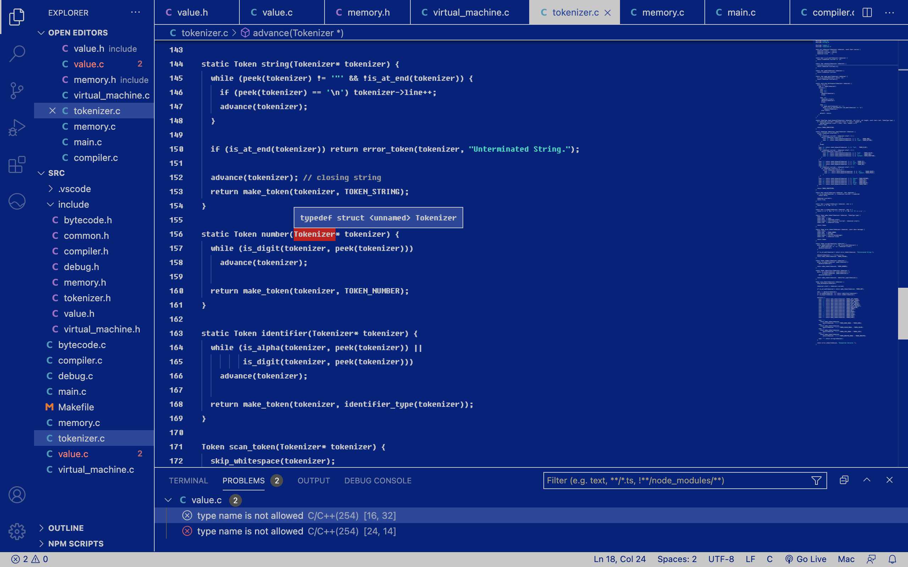

# Real Retro

A color theme for those who don't need no newfangled syntax highlighting or bright colors. Step back to the good ol' days of SAM for programming in the day, or try out a DOS-like environment for those late nights and weary eyes.

Okay, strings are green and comments are gray, but that's all you get!
